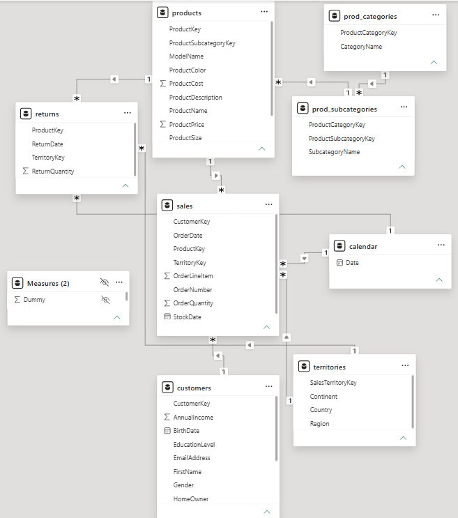
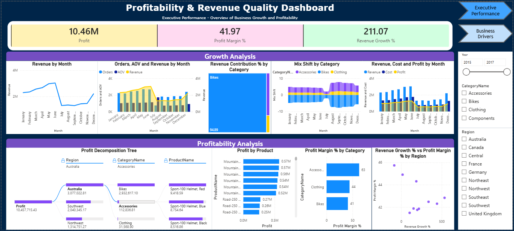
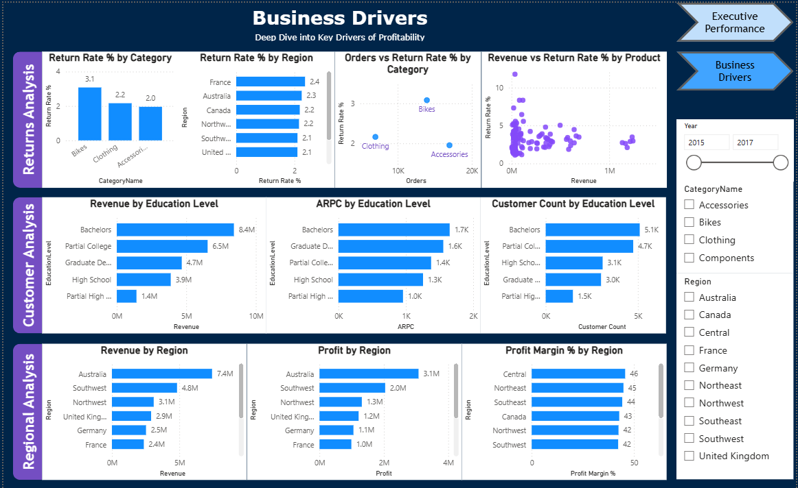

# Adventure Works Profitability & Commercial Performance Analytics

**Tools:** Power BI · Power Query · DAX · SQL · Excel
<br>
**Dataset:** Adventure Works Sales Data — [Kaggle](https://www.kaggle.com/datasets/ukveteran/adventure-works/data?select=AdventureWorks)

---

## Business Problem

Revenue growth alone doesn't guarantee business success — margin erosion, rising costs, return leakage, and regional underperformance can all hide behind a healthy top line.

This project evaluates whether Adventure Works' commercial growth (2015–2017) is translating into **sustainable profitability**, for a Profitability Analysis stakeholder responsible for monitoring financial performance and allocating resources.

---

## Key Findings

| Metric | Value |
|---|---|
| Revenue Growth | **211.07%** — driven mainly by order volume, not AOV |
| Profit Margin | **~42%** — healthy, growth is largely value-accretive |
| Bikes category revenue share | **~95%** — high concentration risk |
| Bikes return rate | **Highest among major categories** — direct margin leakage |
| Top region | **Australia** — leads revenue and profit, but also concentration risk |
| Margin quality | **Accessories outperform higher-revenue categories** — scale ≠ margin |

---

## Insights → Recommendations → Impact

| Insight | Recommendation | Expected Impact |
|---|---|---|
| Revenue growth (211%) is volume-driven, not price-driven | Sustain growth while monitoring profitability | Continued expansion with controlled margin risk |
| Bikes = ~95% of category revenue | Diversify growth across other categories | Lower revenue concentration risk |
| Profit Margin holds near 42% | Keep prioritizing profitable products/regions | Sustained profitability |
| Bikes has the highest return rate | Targeted return-reduction initiatives | Higher Net Revenue and Profit |
| Australia dominates revenue and profit | Replicate its commercial practices in weaker regions | Improved regional performance |
| Margin varies significantly by category | Optimize product mix toward higher-margin categories | Higher Profit Margin % |

---

## Data Model

Hybrid dimensional model: Sales and Returns as fact tables, with a snowflaked product hierarchy (Products → Subcategories → Categories) and Customer/Territory/Calendar dimensions for context.



**Dataset:** 56,046 sales records · Jan 2015 – Jun 2017 (H1 2017 partial)

---

## Dashboard

**Page 1 — Executive Performance:** Profit, Profit Margin, and Revenue Growth KPIs; revenue trend, AOV, contribution, and mix-shift analysis.



**Page 2 — Business Drivers:** Returns, product profitability, customer segments, regional performance, and margin analysis — built to identify root causes behind Page 1's numbers.



---

## Business Questions & KPI Framework

This project was scoped around 11 business questions across Growth, Regional, Returns, Customer, and Product/Profitability analysis, supported by a 3-tier KPI framework (Outcome / Diagnostic / Supporting metrics).

📄 Full question set and KPI definitions: [`01_Business_Understanding/KPI_Framework.md`](01_Business_Understanding/KPI_Framework.md)
<br>
📄 Formal requirements: [`01_Business_Understanding/Business_Requirements_Document.pdf`](01_Business_Understanding/Business_Requirements_Document.pdf)

---

## Assumptions & Constraints

| ID | Assumption / Constraint |
|---|---|
| AC-01 | Dataset contains partial 2017 data (H1 only) |
| AC-02 | Returns table does not contain CustomerKey |
| AC-03 | Returns do not include return reasons |
| AC-04 | Discount information unavailable |
| AC-05–08 | Revenue, Cost, Profit, and Margin derived from ProductPrice, ProductCost, and OrderQuantity |
| AC-09 | OrderNumber does not support basket analysis |
| AC-10 | Customer segmentation limited to available attributes |

---

## How to Reproduce

1. Download the Adventure Works dataset from Kaggle *(add exact link)*.
2. Load Sales, Returns, Customers, Products, Product Categories/Subcategories, Territories, and Calendar tables into Power BI.
3. Apply data quality checks: FK integrity, PK uniqueness, missing values, duplicates (see Data Preparation below).
4. Build the dimensional model per [`02_Data/Data_Model_Documentation.md`](02_Data/Data_Model_Documentation.md).
5. Recreate DAX measures (see below) or reference [`04_Insights/Executive_Insights_Report.md`](04_Insights/Executive_Insights_Report.md) for full measure logic.

> Note: no `.pbix` file is currently included in this repo — screenshots and documentation represent the build. A shareable `.pbix` may be added in a future update.

---

## Data Preparation

Validated foreign key integrity, primary key uniqueness, data types, missing values, duplicate records, and relationship consistency before modeling. Transformations implemented in Power Query.

---

## DAX Measures Developed

| Foundational | Derived | Advanced |
|---|---|---|
| Revenue, Cost, Orders, Units Sold, Return Quantity, Customer Count | Profit, AOV, ASP, ARPC, Return Value, Net Revenue, Return Rate % | Profit Margin %, Revenue Contribution %, Mix Shift, Revenue Growth % |

---

## Tools & Their Role

| Tool | Used For |
|---|---|
| Power BI | Data modeling and dashboard development |
| Power Query | Data cleaning, transformation, validation |
| DAX | KPI, profitability, and growth calculations |
| SQL | Data querying and validation |
| Excel | Data exploration and validation |

---

## Repository Structure

```text
Adventure-Works-Profitability-Analytics/
├── README.md
├── 01_Business/
│   ├── Business_Requirements_Document.pdf
│   └── KPI_Framework.md
├── 02_Data/
│   ├── Data_Model.png
│   └── Data_Model_Documentation.md
├── 03_Dashboard/
│   ├── Page_1.png
│   └── Page_2.png
├── 04_Insights/
│   └── Executive_Insights_Report.md
└── 05_Case_Study/
    └── Adventure_Works_Case_Study.pdf
```

---

*Feedback and questions welcome via GitHub Issues.*
